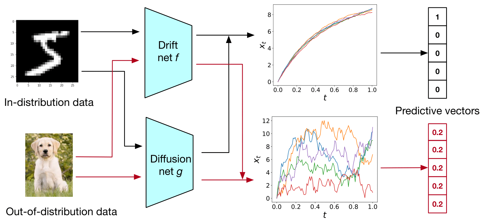

# SDE Net (Keras)
This repo contains the code for the paper:

Lingkai Kong, Jimeng Sun and Chao Zhang, SDE-Net: Equipping Deep Neural Network with Uncertainty Estimates, ICML2020.

[[paper](https://arxiv.org/abs/2008.10546)] [[video](https://www.youtube.com/watch?v=RylZA4Ioc3M)]



## Package installation

```bash
virtualenv -p python3 venv && source venv/bin/activate # optional but recommended.
pip install -r requirements.txt && pip install -e . # install the package.
```

## Training & Evaluation

```bash
DATASET="mnist" # mnist | svhn | cifar10.
OUT_DATASET="svhn" # mnist | svhn | cifar10.
```

#### MNIST

Training vanilla ResNet on MNIST and evaluating it on MNIST/SVHN: 

```bash
python sdenet/train/resnet_train.py --task mnist
python sdenet/eval/eval_detection.py --pre_trained_net save_resnet_mnist/final_model.h5 --network resnet --dataset mnist --out_dataset svhn
```

Training *SDE Net* on MNIST and evaluating it on MNIST/SVHN:

```bash
python sdenet/train/sdenet_train.py --task mnist
python sdenet/eval/eval_detection.py --pre_trained_net save_sdenet_mnist/final_model.h5 --network sdenet --dataset mnist --out_dataset svhn
```

#### SVHN

Training vanilla ResNet on SVHN and evaluating it on SVHN/CIFAR10: 

```bash
python sdenet/train/resnet_train.py --task svhn
python sdenet/eval/eval_detection.py --pre_trained_net save_resnet_mnist/final_model.h5 --network resnet --dataset svhn --out_dataset cifar10
```

Training *SDE Net* on SVHN and evaluating it on SVHN/CIFAR10:

```bash
python sdenet/train/sdenet_train.py --task svhn
python sdenet/eval/eval_detection.py --pre_trained_net save_resnet_mnist/final_model.h5 --network sdenet --dataset svhn --out_dataset cifar10
```

#### YearMSD

Work in progress...
